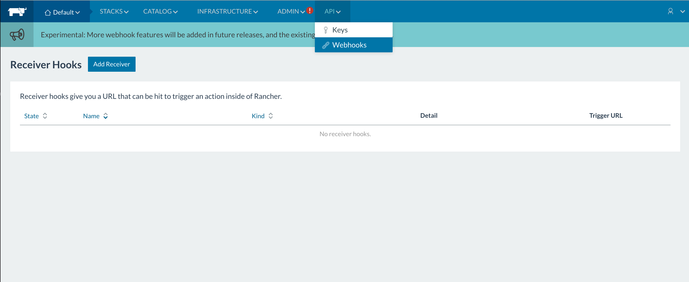

# Webhooks

## Webhook-service
Rancher has added a new feature in 1.4 for webhooks. Webhooks are a way of getting real time data of your application, and executing pre-defined actions for the application. All this is done without having to query the application periodically. We have implemented webhooks with our new microservice, called webhook-service. Webhook-service has drivers defined for actions to be taken in case a particular event occurs. I will explain this using our current driver, scaleService. The driver scaleService is for scaling up and down of a service by a given number of containers.

### Creating a webhook
Navigate to **API -> Webhooks** in the UI. This is where all the webhooks you create for the selected environment will be listed under `Receiver Hooks`  

Click on `Add Receiver` to create the webhook. You will see all these fields to be entered for creating the webhook.  

On this page, the fields to be entered are as follows 
- **Name**: Every webhook should be given a unique name so it can be easily identifed.
- **Kind**: The `Kind` dropdown gives a list of all drivers available in webhook-service. Select a driver from this list. (Only `Scale a Service` is available for 1.4)
- **Action**: This field lets specify the action specific to the driver. For the scaleService driver, the only two actions are `up`(increase the number of containers) and `down`(decrease the number of containers).
- The fields after this are specific to the scaleService driver
 - **Target Service**: Select the service to be scaled from this dropdown  

 - **By**: The field `By` asks the user to enter the amount by which the selected service should be scaled.
 - **Minimum Scale** and **Maximum Scale**: Enter the minimum and maximum number of containers your service can be allowed to have. Scaling the service beyond these values using webhooks won't be allowed.

Click on `Create` once all fields are entered  

